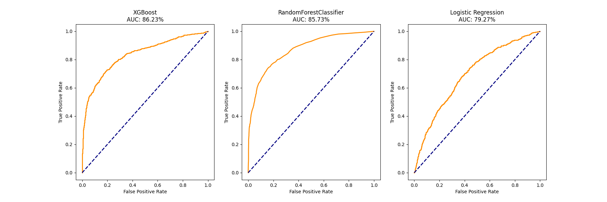

# CODSOFT
## Codsoft Internship Task Submissions repository

# CUSTOMER CHURN PREDICTION (Task 3)
Model to predict customer churn for a subscription based service or business. 
Use historical customer data, including features like usage behavior and customer demographics.
Using Descion Tree And Logistic regression and Xgboost and have 86% accuracy. 

